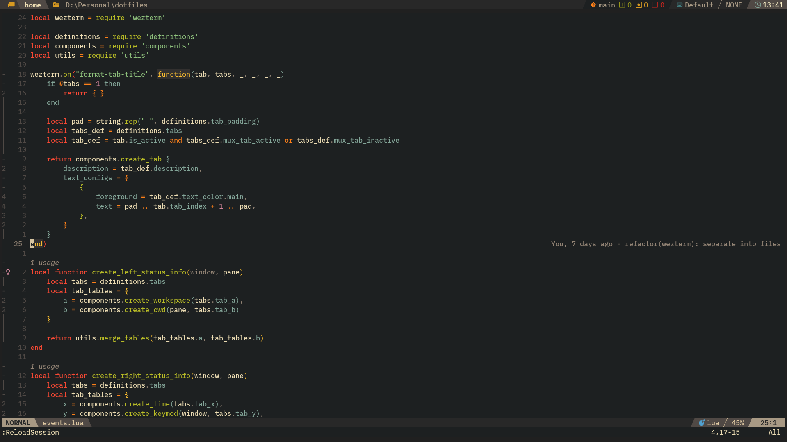

# dotfiles

The archive for the dotfiles that I use daily, mostly (but not bounded to) consists the configurations of:
- [Neovim](./config/nvim)
- Fish shell
- Wezterm
- [Linux setup](./linux)

## Screenshots

This is how it looks like to use my Wezterm + Nvim ;)

